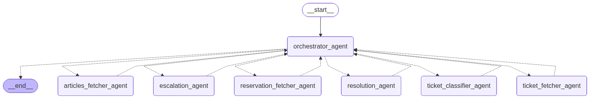

# Introduction
This README contains the design of the Multi-Agent System (MAS) for the Autonomous Knowledge Agent.

# Requirements

1. [Project specification](#project_specification)
    * [High-level description](#high_level_description)
    * [Key capabilities](#key_capabilities)
    * [Inputs & Deliverables](#inputs_and_deliverables)

2. [Take-aways](#take_aways)
    * [Primary goal](#primary_goal)
    * [Functional Requirements](#functional_requirements)
    * [Non-Functional Requirements](#non_functional_requirements)

3. [Design](#design)
    * [Roles & Resonsibilities](#roles_and_responsibilities)
    * [Architecture pattern]($architecture_pattern)
    * [Communication & Data Flow](#communication_and_data_flow)

## Project specification <a name="project_specification"></a>
This is a quote from the project description:

### High-level description <a name="high_level_description"></a>
```
(...) UDA-Hub, a Universal Decision Agent designed to plug into existing customer support systems (Zendesk, Intercom, Freshdesk, internal CRMs) and intelligently resolve tickets. But this isn’t just another FAQ bot.

The goal? Build an agentic system that reads, reasons, routes, and resolves, acting as the operational brain behind support teams.

You’ll need to design an agent system that can:

* Understand customer tickets across channels
* Decide which agent or tool should handle each case
* Retrieve or infer answers when possible
* Escalate or summarize issues when necessary
* Learn from interactions by updating long-term memory

Your agent should not only automate, it should decide how to automate!
```

### Key capabilities: <a name="key_capabilities"></a>

Multi-Agent Architecture with LangGraph Design and orchestrate specialized agents (e.g., Supervisor, Classifier, Resolver, Escalation…).

Input Handling Accept incoming support tickets in natural language with metadata (e.g., platform, urgency, history).

Decision Routing and Resolution

Route tickets to the right agent based on classification
Retrieve relevant knowledge via RAG if needed
Resolve or escalate based on confidence and context
Memory Integration

Maintain state during steps of the execution
Short-term memory is used as context to keep conversation running during the same session
Store and recall long-term memory for preferences, as an example

### Inputs & Deliverables <a name="inputs_and_deliverables"></a>
**Inputs:**
* Incoming support ticket (text + metadata)
* Internal knowledge base (FAQ, previous tickets)
* Optional internal tool (e.g., refund)
* Memory store (for prior conversations and resolutions)

**Deliverables:**
A LangGraph-powered multi-agent system that:
* Understands tickets
* Routes to correct agent with tools
* Resolves or escalates based on decision logic
* Uses memory appropriately


## Take-aways <a name="take_aways"></a>

### Primary goal <a name="primary_goal"></a>
The Autonomous Knowledge Agent needs to accept tickets raised by users of the CultPass system, understand them, make decisions about what informations is needed (FAQ and / or previously resolved tickets, BUT also potentially info about the user like: What reservations he might have?), and then provide an answer to that ticket OR make a decision that it cannot be resolved and escalate the ticket to a human.

### Functional Requirements <a name="functional_requirements"></a>
* The MAS system can be asked questions in the form of a ticket alongside with metadata about the date, the user, etc.
* The system is capable of composing a response that utilizes past tickets, user info, user reservations, and FAQ articles

### Non-Functional Requirements <a name="non_functional_requirements"></a>


# Design <a name="design"></a>
Initially, I considered a more flexible architecture, something like the Network type of a system, but even at the stage of designing it on a piece of paper it became complicated.

So, I settled upon an Orchestrator architecture with the following graph:


The agents are explained in more detail in the following section.

However, before diving deeper, I think it helps to first see the `AgentState` whose attributes are available and updated through the course of going through the graph:
```python
class AgentState(MessagesState):
    ticket_text: str
    ticket_metadata: dict[str, str]
    account_id: str
    user_id: str | None = None

    # Classification attributes
    tags: list[str]
    is_ticket_classified_score: float = -1.0
    needs_info_about_previous_user_tickets_score: float = -1.0
    needs_info_about_reservations_score: float = -1.0

    # Previous tickets attributes
    previous_tickets: list[dict[str, str]] = []
    
    # Reservations attributes
    reservations: list[dict[str, str]] = []

    # Articles attributes
    relevant_articles: list[dict[str, str]] = []

    # Resolution attributes
    resolution_text: str | None = None
    is_resolved_score: float = -1.0
```

## Roles & Responsibilities <a name="roles_and_responsibilities"></a>

#### Agent 1: Orchestrator
This agent is responsible for all the logic about which nodes of the graph (agents) MUST be visited and which are visited if certain conditions are met.

#### Agent 2: Ticket Classifier
This is probably the most involved agent. It's responsible for assigning tags to the ticket raised by the user. The idea is to provide all tags used in the available FAQ questions as input for the LLM. In addition, I ask the LLM to provide three seperate scores (from 0 to 100):
1. For self-assessment of how well the ticket was classified
2. For judgement about whether the ticket seems to require previous user tickets
3. For judgement about whether the user reservations are needed for answering the question.

These three scores will be then used by the Orchestrator to determine the downstream agent use and prompts.

#### Agent 3: Ticket Fetcher
This is a simple agent whose job is to fetch all tickets raised in the past by this particular user. These tickets are then used by the downstream agents.

#### Agent 4: Reservation Fetcher
This is again a simple agent whose job is to fetch all reservations for the user raising the ticket.

#### Agent 5: Article Fetcher
This is an agent whose task is to get all FAQ articles from the DB that share at least one tag with the ticket raised by the user.

#### Agent 6: Resolution Agent
This agent, along with the Ticket Classifier, is again a more complicated one. It utilizes a complicated prompt whose pieces are composed dynamically depending on the `AgentState` updated thus far by the upstream agents. I'm also alsking the LLM to provide a self-assessment score to determine if we can pass on the response to the user (as a resolution to the ticket), OR whether we should instead escalate it to a specialized human support worker.

#### Agent 7: Escalation Agent
This agent's responsibility is to inform the user the ticket was misunderstood and suggest how he might improve it, or whether the user would like a human to tackle his case.